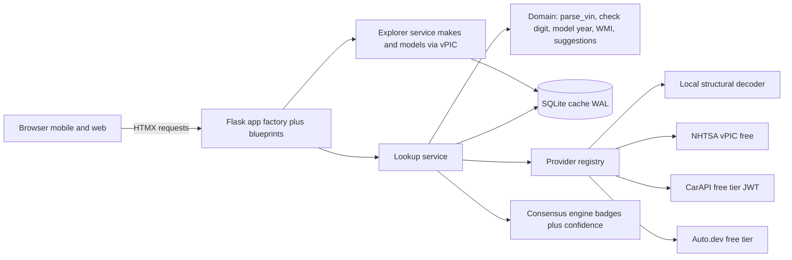
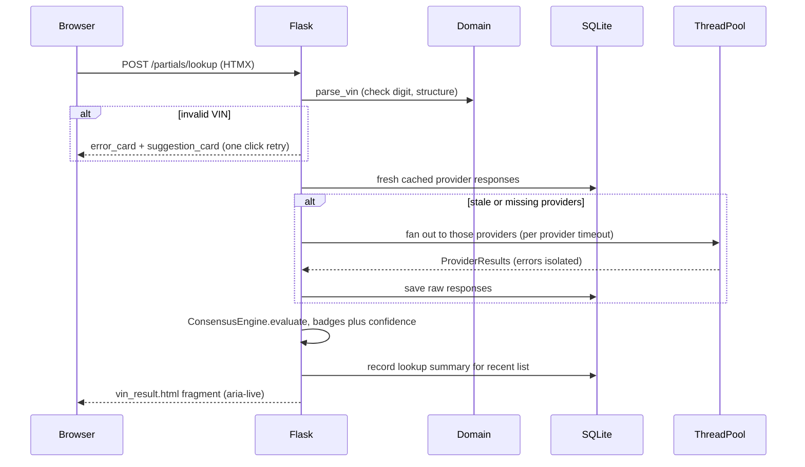

# Architecture

VIN Lookup is a Flask application that decodes Vehicle Identification
Numbers by cross-checking multiple free data sources and showing the
agreement level for each field. Architectural decisions are recorded in
[docs/adr](adr/), one file per decision.

## System context

## Lookup sequence

## Layers

| Layer | Package | Responsibility |
|---|---|---|
| Domain | `app/domain/` | Pure VIN logic, no I/O: ISO 3779 check digit, model year decoding, WMI tables, parsing, typo suggestions, normalized `VehicleRecord` |
| Providers | `app/providers/` | One module per source behind `VinProvider`; registry filters on available credentials |
| Consensus | `app/consensus/` | Per-field agreement (confirmed, single, conflict, unknown), weighted confidence, provenance |
| Services | `app/services/` | Lookup orchestration (cache, thread pool fan out) and the makes/models explorer |
| Cache | `app/cache/` | SQLite repositories: raw provider responses (30 day TTL), lookup summaries, catalog cache (7 day TTL) |
| Web | `app/routes/`, `app/templates/` | Pages, HTMX partials, JSON API under `/api/v1` |

## Key properties

- Fields no source reports render as "not available"; conflicting sources
  are shown side by side rather than resolved silently.
- Providers without keys are skipped at startup, and a provider failing
  mid-lookup only removes its vote. The local structural decoder
  guarantees a result even fully offline.
- Raw provider responses are cached, so mapper and consensus improvements
  apply to previously fetched VINs without refetching.
- NHTSA vPIC needs no key. CarAPI and Auto.dev are optional enrichment on
  their free tiers, and SQLite is the only datastore.
